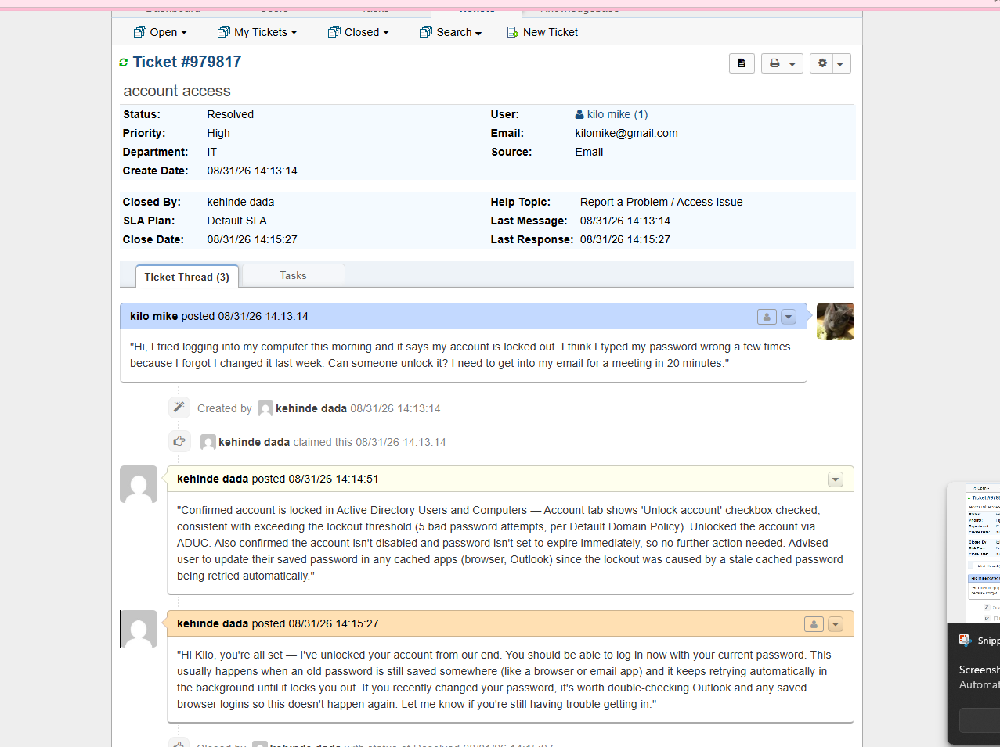

# Windows Server AD Home Lab

A self-built lab covering Active Directory, client management, networking, and a ticketing system — built to practice the actual day-to-day work of an entry-level IT support / help desk role, not pentesting.

**Stack:** Windows Server 2022 (DC), Windows 11 + Windows Server 2025 (clients), VMware Workstation Pro, pfSense CE, XAMPP + osTicket

**Network:** `10.10.10.0/24` — DC01 at `.1`, DHCP pool `.100`–`.200`, pfSense gateway at `.254`

---

## 1. Domain Controller — AD DS, DNS, DHCP

Built `DC01` as a Windows Server 2022 VM on an isolated internal VMware network (later standardized on a shared Custom VMnet — see the networking section for why). Installed AD DS and promoted it to a new forest (`kenny.local`), which pulled in DNS automatically. Set a static IP (`10.10.10.1`), built an OU structure (`Employees`, `IT`, `Sales`), and created test user accounts.

Installed the DHCP role and created a scope (`10.10.10.100`–`200`) so clients could get an IP automatically instead of static configuration on every machine.

**Checkpoint:** working DC handing out IPs, resolving DNS, and hosting AD — the foundation everything else sits on.

## 2. Client Join, User Management, Group Policy

Built `PC01` (Windows 11), pointed its DNS at `10.10.10.1` so it could locate the domain, and joined it to `kenny.local`. Logged in as a domain user to confirm the join worked end to end.

Practiced the actual tickets this setup exists to simulate: resetting a locked-out user's password, disabling/re-enabling an account, adding a user to a security group — all from Active Directory Users and Computers on the DC.

Created several Group Policy Objects and pushed them to the domain: a password complexity/lockout policy, a Control Panel restriction (verified locking out standard users while excluding Domain Admins via an explicit Deny on "Apply group policy" in Delegation), and a mapped network drive pointing at `\\DC01\Finance`. Verified each with `gpupdate /force` — the drive map in particular was confirmed not just present but writable by a Finance-Team member, proving the GPO drive mapping plus the underlying NTFS/share permissions were working together correctly.

Also built a second client, `PC02` (Windows Server 2025), but kept it on a local account rather than joining it to the domain — useful as a deliberate contrast case for troubleshooting local vs. domain sign-in issues, a common source of confusion in real help desk tickets. PC02 gets its IP via a DHCP reservation on DC01 (tied to its MAC address) rather than a static config or the general dynamic pool.

**Checkpoint:** can create/reset/disable AD accounts and push a GPO end-to-end.

## 3. File Shares — NTFS + Share Permissions

Created a shared folder on the DC (`C:\Shares\Finance`), a dedicated security group (`Finance-Team`) in AD, and layered NTFS permissions (Modify for the group) on top of share-level permissions. Added a test user to the group and confirmed access worked only for group members — then confirmed it was correctly denied for a non-member.

**Note on printer sharing:** attempted to share a printer as part of this step using the built-in Microsoft Print to PDF virtual printer — Windows explicitly blocks sharing on virtual/software printers ("Sharing is not supported for this type of printer"). Tried Microsoft XPS Document Writer instead and hit the same restriction. Skipped printer sharing as a result — it was a stretch item, and the NTFS/share permission work was the actual checkpoint for this step.

**Checkpoint:** handled the two most common real help desk tickets — "I can't access the shared drive" and (partially, with the caveat above) "I can't print."

## 4. Networking — DHCP Options, Subnetting, pfSense

Configured DHCP scope options (006 DNS Server) so clients get full config automatically. Practiced subnetting on paper, splitting `10.10.10.0/24` into four /26 subnets.

### Building pfSense as a router/firewall

Installed pfSense CE (FreeBSD 14 base) as a third VM with two network adapters — WAN on NAT (internet-facing), LAN on the same Custom VMnet as the rest of the lab. Assigned interfaces (em0 = WAN, em1 = LAN based on VM adapter order), then set the LAN interface to `10.10.10.254/24` and explicitly declined pfSense's own DHCP server on LAN, since DC01 already owns that role — running two DHCP servers on one network causes clients to get inconsistent leases depending on which server answers first.

Updated DC01's DHCP scope option 003 (Router) to `10.10.10.254` so clients would actually use pfSense as their gateway.

**Firewall rule — written and tested.** Added a rule on the LAN interface (Block, IPv4, ICMP — Echo request, Source: LAN subnets, Destination: Any) above the default allow rules, applied it, then verified from PC01: `ping 1.1.1.1` (crossing pfSense to the internet) timed out as expected, while `ping` to a local LAN host stayed unaffected — confirming the rule was scoped correctly and actually blocking traffic, not just breaking the network wholesale. First attempt at this accidentally targeted "LAN address" (pfSense's own interface IP) instead of "LAN subnets" as the source, which matched zero traffic (0/0 B in the rule's state counter) — corrected by re-editing the source scope.

### Break/fix drills

**APIPA after a network change.** After moving DC01 onto a Custom VMnet to align with pfSense, PC01 (still on the old Host-only network) started pulling an APIPA address (`169.254.x.x`) on `ipconfig /renew` — it couldn't reach DC01's DHCP server at all, since they were now on two different, disconnected network segments. Fixed by moving PC01's adapter to match DC01's and pfSense's LAN (Custom VMnet), confirmed with a successful renew.

**Internet reachable by IP, not by name.** After DHCP/gateway config, `ping 8.8.8.8` and `ping 1.1.1.1` succeeded but nothing resolved by domain name in a browser — isolated with `nslookup google.com`, which confirmed DNS, not routing, was the problem (routing/NAT through pfSense was already working fine). Root cause was twofold: DC01 (as a statically-configured, non-DHCP machine) never had a default gateway set, so it couldn't forward external queries anywhere; and DC01's DNS forwarders list contained only stale, non-functional default IPv6 placeholder addresses (`fec0:0:0:ffff::1/2/3`) instead of real upstream resolvers. Fixed by setting DC01's gateway to `10.10.10.254` and replacing the forwarders with real public resolvers (`8.8.8.8`, `1.1.1.1`).

**Checkpoint:** functioning gateway, working DNS resolution chain end to end (client → DC01 → pfSense → internet), two real diagnosed-and-fixed network outages using `ping`/`nslookup` to isolate DNS vs. routing, and a firewall rule written and verified end to end.

## 5. Ticketing System — osTicket on XAMPP

Installed XAMPP (Apache/MySQL/PHP) on the host, downloaded osTicket, and extracted it into `htdocs`.

### Installer troubleshooting

The install wizard repeatedly reported the config file (`ost-config.php`) as missing even after it was visibly present in File Explorer, correctly named, writable, and unblocked. Root cause turned out to be a well-known Windows/XAMPP gotcha: renaming the sample config with file extensions hidden silently produced a double extension (`ost-config.php.php`) rather than the intended filename — confirmed with `dir` at the command line rather than trusting Explorer's display, then fixed with `ren`.

Getting past that surfaced a second issue: osTicket's installer requires a non-blank MySQL password, but XAMPP's default root account has none, and changing it once through phpMyAdmin didn't take effect everywhere — MySQL keeps separate credential entries per host (`root@localhost`, `root@127.0.0.1`, etc.), and only one had been updated. Resolved by stopping MySQL, starting `mysqld --console --skip-grant-tables` to bypass authentication, connecting with the MariaDB client, and running `ALTER USER` against each root host entry to set one consistent password — then updating phpMyAdmin's own `config.inc.php` to match, so it could keep auto-logging in.

Installed successfully after that, then removed write access from `ost-config.php` (`attrib +R`) and deleted the `setup/` directory, per osTicket's own post-install security guidance.

### Departments and mock tickets

Created four departments — Account Access, Hardware, Network, Software — as standalone, top-level departments (initially created them as sub-departments under the default "Support" department, then restructured to top-level for clarity, since they represent independent ticket queues rather than a hierarchy). Also learned that osTicket's ticket-creation dropdown only lists departments an agent has access to, which caused early confusion when new departments didn't appear until permissions/refresh resolved it.

Logged mock tickets for real issues fixed earlier in the build (account lockout, printer sharing limitation, APIPA/DHCP outage, DNS forwarder failure, share permissions), each written in plain end-user language, worked with an internal note documenting the actual diagnostic steps taken, and closed out with a customer-facing resolution message — mirroring a real help desk ticket lifecycle from intake to resolution.

**Example — Ticket #979817, account lockout:** user reported being locked out after mistyping a recently-changed password. Diagnosis confirmed the account was locked in ADUC (Account tab, "Unlock account" checked) consistent with exceeding the domain's lockout threshold, and traced the likely cause to a stale cached password (e.g. in a browser or Outlook) auto-retrying in the background. Unlocked the account via ADUC, then advised the user to update any saved credentials so the same lockout wouldn't recur. Full thread — original request, internal diagnostic note, and resolution reply — resolved in under two minutes.

**Checkpoint:** a working ticketing system with a real department structure and a small portfolio of tickets that map directly to problems actually diagnosed and fixed elsewhere in this lab.

---

## What this demonstrates

- Standing up and administering Active Directory: users, groups, OUs, Group Policy
- File server permissions (NTFS + share-level) and the difference between them
- DHCP/DNS administration and diagnosing outages with standard tools (`ping`, `nslookup`, `ipconfig`)
- Building and configuring a router/firewall (pfSense) from scratch, including WAN/LAN separation and avoiding DHCP conflicts
- Methodical troubleshooting under ambiguity — several of the hardest problems in this build (the hidden double file extension, the multi-host MySQL credential mismatch) had no single obvious error message, and were only solved by systematically ruling out causes one at a time
- Operating a real ticketing system: department structure, ticket lifecycle, and writing resolutions clearly for a non-technical audience
